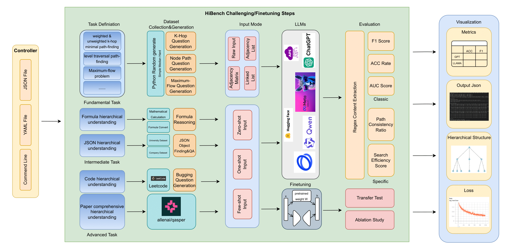
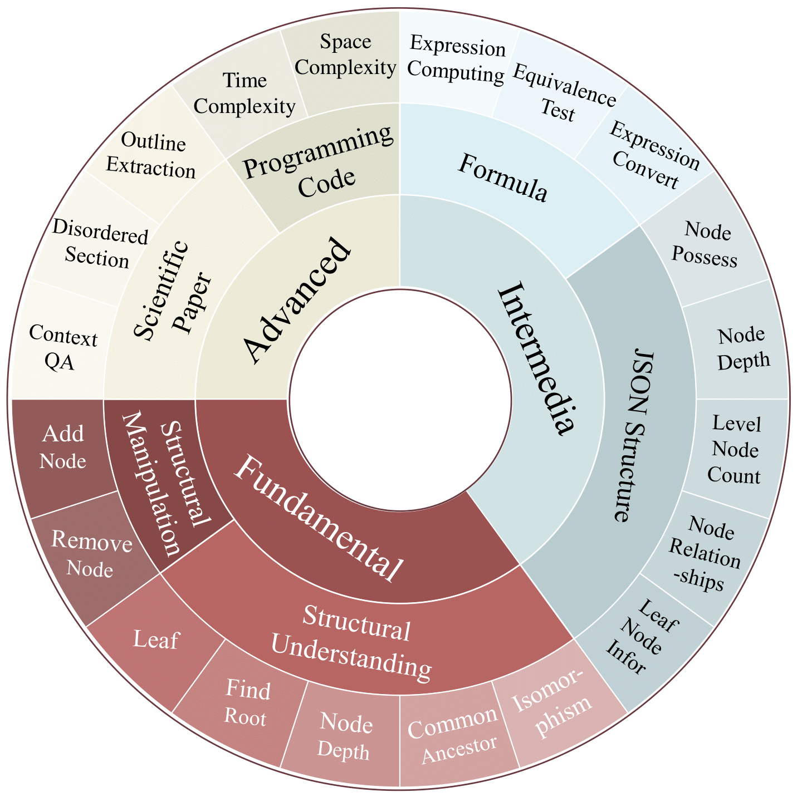
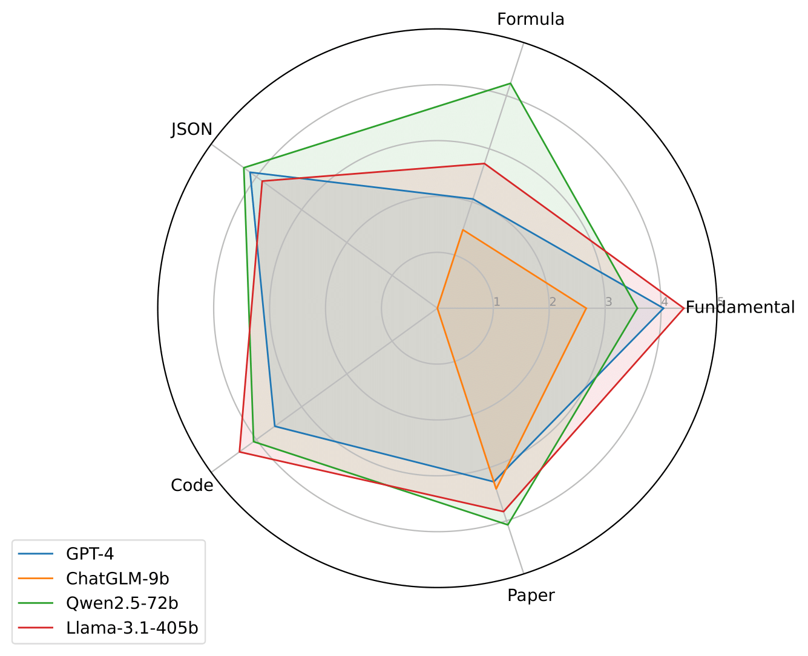
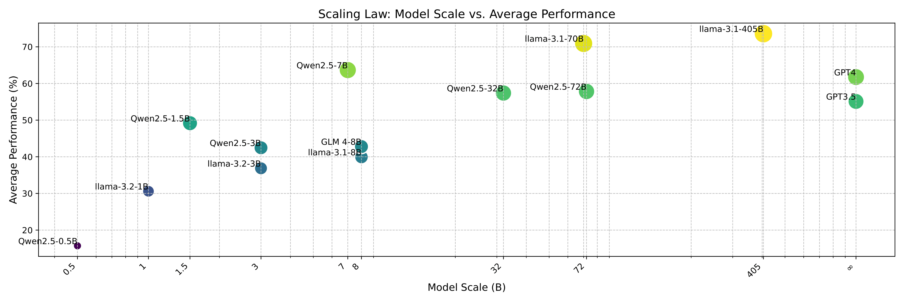

# 👋HiBench: Challenging LLMs Capability on Hierarchical Structure Understanding
<div align="center">
Zhuohang Jiang†, Pangjing Wu†, Ziran Liang†, Xu Yuan†, Qi Chen†,
Ye Jia†, Jiancheng Tu†

</div>  
<div align="center"><span style="font-size: smaller;">
<br>†: joint first author & equal contribution
*: corresponding author</br>
</span>
</div>

<br>
<div align="center">

[](https://pytorch.org/) 
[](https://huggingface.co/) 
[](https://fireworks.ai/) 
[](https://azure.microsoft.com) 


[](https://www.llama.com/) 
[](https://github.com/QwenLM/Qwen) 
[](https://github.com/THUDM/ChatGLM-6B) 
[](https://openai.com/) 


[](https://huggingface.co/microsoft/Phi-3.5-mini-instruct) 
[](https://huggingface.co/internlm) 
[](https://huggingface.co/01-ai) 
[](https://github.com/baichuan-inc/Baichuan2/) 
[](https://huggingface.co/mistralai/Mistral-7B-Instruct-v0.3) 


</div>

## Overview
**Welcome to 👋HiBench, the First Comprehensive Hierarchical Structure Understanding Benchmark of LLMs.**
- To our best knowledge, it is the **first benchmark** specifically designed to evaluate the hierarchical reasoning abilities of LLMs, encompassing tasks of varying scales and complexities for comprehensive evaluation.
- We evaluate **15 LLMs** and reveal that even the most advanced LLMs struggle with performance, offering new insights into hierarchical reasoning.
- We propose a synthetic hierarchical dataset for task-specific fine-tuning, which enhanced LLM's ability on hierarchical reasoning, surpassing **GPT4** by **0.35\%** throughout all tasks.
- Cite and star if you feel helpful. This will encourage us a lot 🥰.

<div align="center">
    
    <p style="font-size: 1.2em;"><strong>Figure 1: </strong>Overview of the paradigm for HiBench.</p>
</div>

## Task Definition
HiBench includes a range of tasks from basic to advanced levels, specifically comprising 7 fundamental hierarchical understanding tasks at the Fundamental level, 5 JSON structure understanding tasks, and 3 formula structure understanding tasks at the Intermedia level; 2 code structure understanding tasks and 3 scientific paper understanding tasks at the Advanced level, totaling **20** tasks covering **15,852** problems.

<div align="center">
    
    
</div>
<div style = "display: flex">
<div align="center" style="width: 43%;" >
    <p style="font-size: 1.2em;"><strong>Figure 2: </strong>Task definition in Hibench. Hibench contains 3 levels of evaluation, 5 types of tasks, and 20 subtasks.</p>
</div>
<div align="center" style="width: 54%; ">
    <p style="font-size: 1.2em;"><strong>Figure 3: </strong>Performance comparison of the best models from different families on multiple hierarchical tasks.</p>
</div>
</div>


## Features under developing
This repository has completed evaluating Qwen Family, Llama Family, GPT Family and ChatGLM model.

However, more LLMs are currently being evaluated for improved our experiment.Moreover, we will increase more Benchmark Dataset to evaluating LLMs ability of Hierarchical understanding. Updates will be rolled out frequently. 

- [ ] Tested on HiBench for Phi[](https://huggingface.co/microsoft/Phi-3.5-mini-instruct) , InternLM
[](https://huggingface.co/internlm) , Yi 
[](https://huggingface.co/01-ai) 
,baichuan
[](https://github.com/baichuan-inc/Baichuan2/), and Mistral[](https://huggingface.co/mistralai/Mistral-7B-Instruct-v0.3).

- [x] Check all datasets and add binary datasets

## Quick Start
### Install HiBench
```
conda create -n HiBench python=3.11
conda activate HiBench
pip install -r requirements.txt
```
### Evaluation HiBench
```
python ./launch.py
```

## Result
<div align="center">
    
    <p style="font-size: 1.2em;"><strong>Figure 4: </strong>LLM Performance over Fundamental Tasks in HiBench.</p>
</div>


<br>


<div align="center">
<p style="font-size: 1.2em;"><strong>Table 1: </strong>LLM Performance over Fundamental Tasks in HiBench.</p>

<table class="tg"><thead>
  <tr>
    <th class="tg-c3ow">Model Family</th>
    <th class="tg-c3ow">Model</th>
    <th class="tg-c3ow" colspan="7">Plain Hierarchical Structure</th>
  </tr></thead>
<tbody>
  <tr>
    <td class="tg-c3ow"></td>
    <td class="tg-c3ow"></td>
    <td class="tg-c3ow">Leaf</td>
    <td class="tg-c3ow">Find Root</td>
    <td class="tg-c3ow">Node Depth</td>
    <td class="tg-c3ow">Common Ancestor</td>
    <td class="tg-c3ow">Isomorphism</td>
    <td class="tg-c3ow">Add Node</td>
    <td class="tg-c3ow">Remove Node</td>
  </tr>
  <tr>
    <td class="tg-c3ow" rowspan="2">GPT</td>
    <td class="tg-c3ow">GPT3.5</td>
    <td class="tg-c3ow">90.08</td>
    <td class="tg-c3ow">95.91</td>
    <td class="tg-c3ow">13.03</td>
    <td class="tg-c3ow">69.22</td>
    <td class="tg-c3ow">69.65</td>
    <td class="tg-c3ow">1.86</td>
    <td class="tg-c3ow">22.69</td>
  </tr>
  <tr>
    <td class="tg-c3ow">GPT4</td>
    <td class="tg-c3ow">86.70</td>
    <td class="tg-c3ow">98.15</td>
    <td class="tg-c3ow">24.62</td>
    <td class="tg-c3ow">84.74</td>
    <td class="tg-c3ow">78.12</td>
    <td class="tg-c3ow">0.83</td>
    <td class="tg-c3ow">52.40</td>
  </tr>
  <tr>
    <td class="tg-c3ow" rowspan="5">Llama Family</td>
    <td class="tg-c3ow">Llama-3.2-1B</td>
    <td class="tg-c3ow">18.91</td>
    <td class="tg-c3ow">30.93</td>
    <td class="tg-c3ow">46.11</td>
    <td class="tg-c3ow">44.55</td>
    <td class="tg-c3ow">18.74</td>
    <td class="tg-c3ow">0.00</td>
    <td class="tg-c3ow">3.07</td>
  </tr>
  <tr>
    <td class="tg-c3ow">Llama-3.2-3B</td>
    <td class="tg-c3ow">53.54</td>
    <td class="tg-c3ow">70.91</td>
    <td class="tg-c3ow">10.73</td>
    <td class="tg-c3ow">44.12</td>
    <td class="tg-c3ow">54.19</td>
    <td class="tg-c3ow">0.28</td>
    <td class="tg-c3ow">3.41</td>
  </tr>
  <tr>
    <td class="tg-c3ow">Llama-3.1-8B</td>
    <td class="tg-c3ow">60.91</td>
    <td class="tg-c3ow">83.54</td>
    <td class="tg-c3ow">4.19</td>
    <td class="tg-c3ow">69.65</td>
    <td class="tg-c3ow">23.00</td>
    <td class="tg-c3ow">0.00</td>
    <td class="tg-c3ow">4.45</td>
  </tr>
  <tr>
    <td class="tg-c3ow">Llama-3.1-70B</td>
    <td class="tg-c3ow">96.31</td>
    <td class="tg-c3ow">100.00</td>
    <td class="tg-c3ow">11.36</td>
    <td class="tg-c3ow">76.64</td>
    <td class="tg-c3ow">85.10</td>
    <td class="tg-c3ow">2.29</td>
    <td class="tg-c3ow">33.00</td>
  </tr>
  <tr>
    <td class="tg-c3ow">Llama-3.1-405B</td>
    <td class="tg-c3ow">99.72</td>
    <td class="tg-c3ow">100.00</td>
    <td class="tg-c3ow">10.76</td>
    <td class="tg-c3ow">87.98</td>
    <td class="tg-c3ow">91.59</td>
    <td class="tg-c3ow">4.41</td>
    <td class="tg-c3ow">43.77</td>
  </tr>
  <tr>
    <td class="tg-c3ow" rowspan="7">Qwen Family</td>
    <td class="tg-c3ow">Qwen2.5-0.5B</td>
    <td class="tg-c3ow">39.26</td>
    <td class="tg-c3ow">19.14</td>
    <td class="tg-c3ow">9.42</td>
    <td class="tg-c3ow">4.63</td>
    <td class="tg-c3ow">18.52</td>
    <td class="tg-c3ow">0.00</td>
    <td class="tg-c3ow">1.00</td>
  </tr>
  <tr>
    <td class="tg-c3ow">Qwen2.5-1.5B</td>
    <td class="tg-c3ow">56.24</td>
    <td class="tg-c3ow">44.41</td>
    <td class="tg-c3ow">10.24</td>
    <td class="tg-c3ow">12.20</td>
    <td class="tg-c3ow">52.23</td>
    <td class="tg-c3ow">0.15</td>
    <td class="tg-c3ow">1.87</td>
  </tr>
  <tr>
    <td class="tg-c3ow">Qwen2.5-3B</td>
    <td class="tg-c3ow">54.37</td>
    <td class="tg-c3ow">72.96</td>
    <td class="tg-c3ow">5.70</td>
    <td class="tg-c3ow">29.81</td>
    <td class="tg-c3ow">66.34</td>
    <td class="tg-c3ow">0.14</td>
    <td class="tg-c3ow">7.89</td>
  </tr>
  <tr>
    <td class="tg-c3ow">Qwen2.5-7B</td>
    <td class="tg-c3ow">52.55</td>
    <td class="tg-c3ow">75.61</td>
    <td class="tg-c3ow">12.50</td>
    <td class="tg-c3ow">55.12</td>
    <td class="tg-c3ow">72.17</td>
    <td class="tg-c3ow">1.11</td>
    <td class="tg-c3ow">11.70</td>
  </tr>
  <tr>
    <td class="tg-c3ow">Qwen2.5-14B</td>
    <td class="tg-c3ow">59.88</td>
    <td class="tg-c3ow">98.31</td>
    <td class="tg-c3ow">14.04</td>
    <td class="tg-c3ow">74.02</td>
    <td class="tg-c3ow">62.88</td>
    <td class="tg-c3ow">0.56</td>
    <td class="tg-c3ow">37.47</td>
  </tr>
  <tr>
    <td class="tg-c3ow">Qwen2.5-32B</td>
    <td class="tg-c3ow">67.17</td>
    <td class="tg-c3ow">100.00</td>
    <td class="tg-c3ow">13.08</td>
    <td class="tg-c3ow">84.07</td>
    <td class="tg-c3ow">89.90</td>
    <td class="tg-c3ow">0.99</td>
    <td class="tg-c3ow">37.96</td>
  </tr>
  <tr>
    <td class="tg-c3ow">Qwen2.5-72B</td>
    <td class="tg-c3ow">85.35</td>
    <td class="tg-c3ow">100.00</td>
    <td class="tg-c3ow">13.31</td>
    <td class="tg-c3ow">85.73</td>
    <td class="tg-c3ow">82.60</td>
    <td class="tg-c3ow">0.56</td>
    <td class="tg-c3ow">31.33</td>
  </tr>
  <tr>
    <td class="tg-c3ow">GLM</td>
    <td class="tg-c3ow">ChatGLM-9B</td>
    <td class="tg-c3ow">50.10</td>
    <td class="tg-c3ow">94.95</td>
    <td class="tg-c3ow">6.74</td>
    <td class="tg-c3ow">54.80</td>
    <td class="tg-c3ow">73.28</td>
    <td class="tg-c3ow">2.29</td>
    <td class="tg-c3ow">29.67</td>
  </tr>
</tbody></table>
<br>
<p style="font-size: 1.2em;"><strong>Table 2: </strong>LLM Performance over Intermediate Tasks in HiBench.</p>

<table class="tg"><thead>
  <tr>
    <th class="tg-c3ow" rowspan="2">Model Family</th>
    <th class="tg-c3ow" rowspan="2">Model</th>
    <th class="tg-c3ow" colspan="5">JSON Structure</th>
    <th class="tg-c3ow" colspan="3">Formula</th>
  </tr>
  <tr>
    <th class="tg-c3ow">Node Possess</th>
    <th class="tg-c3ow">Node Depth</th>
    <th class="tg-c3ow">Level Node Count</th>
    <th class="tg-c3ow">Node Relationships</th>
    <th class="tg-c3ow">Leaf Node Information</th>
    <th class="tg-c3ow">Expression Computing</th>
    <th class="tg-c3ow">Equivalence Test</th>
    <th class="tg-c3ow">Expression Convert</th>
  </tr></thead>
<tbody>
  <tr>
    <td class="tg-c3ow" rowspan="2">GPT</td>
    <td class="tg-c3ow">GPT3.5</td>
    <td class="tg-c3ow">81.82</td>
    <td class="tg-c3ow">0.00</td>
    <td class="tg-c3ow">25.00</td>
    <td class="tg-c3ow">75.00</td>
    <td class="tg-c3ow">57.14</td>
    <td class="tg-c3ow">11.67</td>
    <td class="tg-c3ow">44.11</td>
    <td class="tg-c3ow">24.61</td>
  </tr>
  <tr>
    <td class="tg-c3ow">GPT4</td>
    <td class="tg-c3ow">48.13</td>
    <td class="tg-c3ow">55.69</td>
    <td class="tg-c3ow">20.24</td>
    <td class="tg-c3ow">74.17</td>
    <td class="tg-c3ow">88.81</td>
    <td class="tg-c3ow">29.67</td>
    <td class="tg-c3ow">83.34</td>
    <td class="tg-c3ow">45.09</td>
  </tr>
  <tr>
    <td class="tg-c3ow" rowspan="5">Llama Family</td>
    <td class="tg-c3ow">Llama-3.2-1B</td>
    <td class="tg-c3ow">15.86</td>
    <td class="tg-c3ow">7.76</td>
    <td class="tg-c3ow">0.00</td>
    <td class="tg-c3ow">30.24</td>
    <td class="tg-c3ow">13.44</td>
    <td class="tg-c3ow">0.00</td>
    <td class="tg-c3ow">32.65</td>
    <td class="tg-c3ow">0.67</td>
  </tr>
  <tr>
    <td class="tg-c3ow">Llama-3.2-3B</td>
    <td class="tg-c3ow">24.91</td>
    <td class="tg-c3ow">0.00</td>
    <td class="tg-c3ow">0.00</td>
    <td class="tg-c3ow">25.83</td>
    <td class="tg-c3ow">36.55</td>
    <td class="tg-c3ow">0.00</td>
    <td class="tg-c3ow">21.99</td>
    <td class="tg-c3ow">3.95</td>
  </tr>
  <tr>
    <td class="tg-c3ow">Llama-3.1-8B</td>
    <td class="tg-c3ow">18.40</td>
    <td class="tg-c3ow">14.51</td>
    <td class="tg-c3ow">10.12</td>
    <td class="tg-c3ow">59.05</td>
    <td class="tg-c3ow">59.59</td>
    <td class="tg-c3ow">2.10</td>
    <td class="tg-c3ow">45.47</td>
    <td class="tg-c3ow">5.03</td>
  </tr>
  <tr>
    <td class="tg-c3ow">Llama-3.1-70B</td>
    <td class="tg-c3ow">43.61</td>
    <td class="tg-c3ow">10.12</td>
    <td class="tg-c3ow">32.14</td>
    <td class="tg-c3ow">68.21</td>
    <td class="tg-c3ow">42.28</td>
    <td class="tg-c3ow">11.33</td>
    <td class="tg-c3ow">63.78</td>
    <td class="tg-c3ow">15.23</td>
  </tr>
  <tr>
    <td class="tg-c3ow">Llama-3.1-405B</td>
    <td class="tg-c3ow">57.48</td>
    <td class="tg-c3ow">30.82</td>
    <td class="tg-c3ow">32.14</td>
    <td class="tg-c3ow">69.17</td>
    <td class="tg-c3ow">78.85</td>
    <td class="tg-c3ow">19.33</td>
    <td class="tg-c3ow">57.44</td>
    <td class="tg-c3ow">29.70</td>
  </tr>
  <tr>
    <td class="tg-c3ow" rowspan="4">Qwen Family</td>
    <td class="tg-c3ow">Qwen2.5-7B</td>
    <td class="tg-c3ow">65.14</td>
    <td class="tg-c3ow">9.33</td>
    <td class="tg-c3ow">22.02</td>
    <td class="tg-c3ow">71.07</td>
    <td class="tg-c3ow">63.47</td>
    <td class="tg-c3ow">5.83</td>
    <td class="tg-c3ow">46.81</td>
    <td class="tg-c3ow">22.61</td>
  </tr>
  <tr>
    <td class="tg-c3ow">Qwen2.5-14B</td>
    <td class="tg-c3ow">57.48</td>
    <td class="tg-c3ow">48.47</td>
    <td class="tg-c3ow">22.02</td>
    <td class="tg-c3ow">79.05</td>
    <td class="tg-c3ow">76.94</td>
    <td class="tg-c3ow">7.00</td>
    <td class="tg-c3ow">74.86</td>
    <td class="tg-c3ow">26.16</td>
  </tr>
  <tr>
    <td class="tg-c3ow">Qwen2.5-32B</td>
    <td class="tg-c3ow">65.14</td>
    <td class="tg-c3ow">56.01</td>
    <td class="tg-c3ow">0.00</td>
    <td class="tg-c3ow">85.00</td>
    <td class="tg-c3ow">71.18</td>
    <td class="tg-c3ow">17.83</td>
    <td class="tg-c3ow">72.37</td>
    <td class="tg-c3ow">29.25</td>
  </tr>
  <tr>
    <td class="tg-c3ow">Qwen2.5-72B</td>
    <td class="tg-c3ow">65.99</td>
    <td class="tg-c3ow">56.47</td>
    <td class="tg-c3ow">20.24</td>
    <td class="tg-c3ow">75.12</td>
    <td class="tg-c3ow">78.85</td>
    <td class="tg-c3ow">52.33</td>
    <td class="tg-c3ow">77.00</td>
    <td class="tg-c3ow">36.14</td>
  </tr>
  <tr>
    <td class="tg-c3ow">GLM</td>
    <td class="tg-c3ow">ChatGLM-9B</td>
    <td class="tg-c3ow">-</td>
    <td class="tg-c3ow">-</td>
    <td class="tg-c3ow">-</td>
    <td class="tg-c3ow">-</td>
    <td class="tg-c3ow">-</td>
    <td class="tg-c3ow">0.00</td>
    <td class="tg-c3ow">46.97</td>
    <td class="tg-c3ow">10.75</td>
  </tr>
</tbody></table>

<br>
<p style="font-size: 1.2em;"><strong>Table 3: </strong>LLM Performance over Practical Tasks in HiBench</p>

<table class="tg"><thead>
  <tr>
    <th class="tg-c3ow" rowspan="2">Model Family</th>
    <th class="tg-c3ow" rowspan="2">Model</th>
    <th class="tg-c3ow" colspan="2">Programming Code</th>
    <th class="tg-c3ow" colspan="3">Scientific Paper</th>
  </tr>
  <tr>
    <th class="tg-c3ow">Space Complexity</th>
    <th class="tg-c3ow">Time Complexity</th>
    <th class="tg-c3ow">Outline Extraction</th>
    <th class="tg-c3ow">Disordered Section</th>
    <th class="tg-c3ow">Context QA</th>
  </tr></thead>
<tbody>
  <tr>
    <td class="tg-c3ow" rowspan="2">GPT</td>
    <td class="tg-c3ow">GPT3.5</td>
    <td class="tg-c3ow">75.00</td>
    <td class="tg-c3ow">60.00</td>
    <td class="tg-c3ow">-</td>
    <td class="tg-c3ow">-</td>
    <td class="tg-c3ow">-</td>
  </tr>
  <tr>
    <td class="tg-c3ow">GPT4</td>
    <td class="tg-c3ow">55.00</td>
    <td class="tg-c3ow">60.00</td>
    <td class="tg-c3ow">90.85</td>
    <td class="tg-c3ow">19.72</td>
    <td class="tg-c3ow">35.23</td>
  </tr>
  <tr>
    <td class="tg-c3ow" rowspan="5">Llama Family</td>
    <td class="tg-c3ow">Llama-3.2-1B</td>
    <td class="tg-c3ow">15.00</td>
    <td class="tg-c3ow">0.00</td>
    <td class="tg-c3ow">38.59</td>
    <td class="tg-c3ow">4.96</td>
    <td class="tg-c3ow">15.77</td>
  </tr>
  <tr>
    <td class="tg-c3ow">Llama-3.2-3B</td>
    <td class="tg-c3ow">0.00</td>
    <td class="tg-c3ow">0.00</td>
    <td class="tg-c3ow">68.55</td>
    <td class="tg-c3ow">23.38</td>
    <td class="tg-c3ow">26.59</td>
  </tr>
  <tr>
    <td class="tg-c3ow">Llama-3.1-8B</td>
    <td class="tg-c3ow">35.00</td>
    <td class="tg-c3ow">45.00</td>
    <td class="tg-c3ow">55.66</td>
    <td class="tg-c3ow">25.43</td>
    <td class="tg-c3ow">27.17</td>
  </tr>
  <tr>
    <td class="tg-c3ow">Llama-3.1-70B</td>
    <td class="tg-c3ow">65.00</td>
    <td class="tg-c3ow">55.00</td>
    <td class="tg-c3ow">88.38</td>
    <td class="tg-c3ow">26.05</td>
    <td class="tg-c3ow">40.39</td>
  </tr>
  <tr>
    <td class="tg-c3ow">Llama-3.1-405B</td>
    <td class="tg-c3ow">75.00</td>
    <td class="tg-c3ow">65.00</td>
    <td class="tg-c3ow">78.33</td>
    <td class="tg-c3ow">21.00</td>
    <td class="tg-c3ow">39.98</td>
  </tr>
  <tr>
    <td class="tg-c3ow" rowspan="4">Qwen Family</td>
    <td class="tg-c3ow">Qwen2.5-7B</td>
    <td class="tg-c3ow">65.00</td>
    <td class="tg-c3ow">20.00</td>
    <td class="tg-c3ow">94.83</td>
    <td class="tg-c3ow">25.43</td>
    <td class="tg-c3ow">36.60</td>
  </tr>
  <tr>
    <td class="tg-c3ow">Qwen2.5-14B</td>
    <td class="tg-c3ow">75.00</td>
    <td class="tg-c3ow">65.00</td>
    <td class="tg-c3ow">89.75</td>
    <td class="tg-c3ow">13.73</td>
    <td class="tg-c3ow">39.92</td>
  </tr>
  <tr>
    <td class="tg-c3ow">Qwen2.5-32B</td>
    <td class="tg-c3ow">65.00</td>
    <td class="tg-c3ow">65.00</td>
    <td class="tg-c3ow">98.22</td>
    <td class="tg-c3ow">19.81</td>
    <td class="tg-c3ow">39.46</td>
  </tr>
  <tr>
    <td class="tg-c3ow">Qwen2.5-72B</td>
    <td class="tg-c3ow">70.00</td>
    <td class="tg-c3ow">60.00</td>
    <td class="tg-c3ow">94.21</td>
    <td class="tg-c3ow">14.43</td>
    <td class="tg-c3ow">42.47</td>
  </tr>
  <tr>
    <td class="tg-c3ow">GLM</td>
    <td class="tg-c3ow">ChatGLM-9B</td>
    <td class="tg-c3ow">-</td>
    <td class="tg-c3ow">-</td>
    <td class="tg-c3ow">56.55</td>
    <td class="tg-c3ow">33.29</td>
    <td class="tg-c3ow">35.71</td>
  </tr>
</tbody></table>
</div>
<!-- ## Quick Start -->


## About
☑️About the Developers:
- All developers of Hibench are PhD/MPhil students of The Hong Kong Polytechnic University 🇭🇰.  
- Hibench's codebase designer is [_Zhuohang Jiang_](https://github.com/jzzzzh).
- The Fundamental Tasks of Hibench are mainly undertaken by [_Pangjing Wu_](https://github.com/Pangjing-Wu) and _Ziran Liang_.
- The Code Programming Task and JSON Task are mainly undertaken by _Qi Chen_ and _Ye Jia_.
- The Paper Task is mainly undertaken by _Xu Yuan_.
- The Formula Task is mainly undertaken by _Jiancheng Tu_.

<!-- ## Acknowledge
We sincerely appreciate [Prof. Hongxia Yang](https://scholar.google.com/citations?user=iJlC5mMAAAAJ&hl=en) for her constructive directions and suggestions. -->

## Citation
If you find our work valuable and it has contributed to your research or projects, we kindly request that you cite our paper. Your recognition is a driving force for our continuous improvement and innovation🤗.

## Star History

[](https://star-history.com/#jzzzzh/HiBench&Date)
